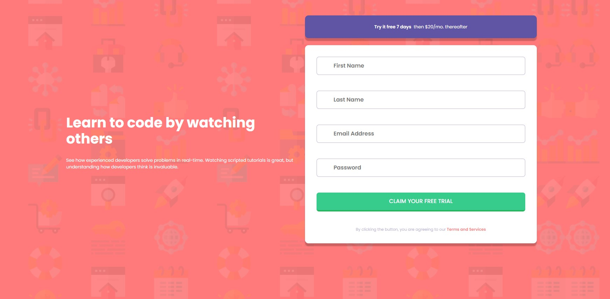

# Frontend Mentor - Intro component with sign up form

This is a solution to the [Intro component with sign up form on Frontend Mentor](https://www.frontendmentor.io/challenges/intro-component-with-signup-form-5cf91bd49edda32581d28fd1). Frontend Mentor challenges help you improve your coding skills by building realistic projects. 

## Table of contents

- [Overview](#overview)
  - [The challenge](#the-challenge)
  - [Screenshot](#screenshot)
  - [Links](#links)
- [My process](#my-process)
  - [Built with](#built-with)
  - [What I learned](#what-i-learned)
  - [Useful resources](#useful-resources)
- [Author](#author)

## Overview

### The challenge

Users should be able to:

- View the optimal layout for the site depending on their device's screen size
- See hover states for all interactive elements on the page
- Receive an error message when the `form` is submitted if:
  - Any `input` field is empty. The message for this error should say *"[Field Name] cannot be empty"*
  - The email address is not formatted correctly (i.e. a correct email address should have this structure: `name@host.tld`). The message for this error should say *"Looks like this is not an email"*

### Screenshot

### Links

- Solution URL: [Solution on Frontend Mentor](https://www.frontendmentor.io/challenges/intro-component-with-signup-form-5cf91bd49edda32581d28fd1/hub?share=true)
- Live Site URL: [Deployed via Vercel](https://intro-component-with-signup-form-omega-two.vercel.app/)

## My process

### Built with

- ReactJS
- SCSS
- Flexbox, Grid
- Formik + Yup
- ViteJS
- Mobile-first workflow

### What I learned

I practiced creating custom fields using the useField hook and Formik. Used SCSS for styling, also used mixin. Tried ViteJS

### Useful resources

- [HTML5 Book](https://html5book.ru)
- [MDN Web Docs](https://developer.mozilla.org)
- [Formik docs](https://formik.org/)
- [Yup](https://www.npmjs.com/package/yup)

## Author

- Website - [GitHub](https://github.com/ostmartin)
- Frontend Mentor - [@ostmartin](https://www.frontendmentor.io/profile/ostmartin)
- LinkedIn - [Arsenii Yermoshkin](https://www.linkedin.com/in/arsenii-yermoshkin-1ba671251/)